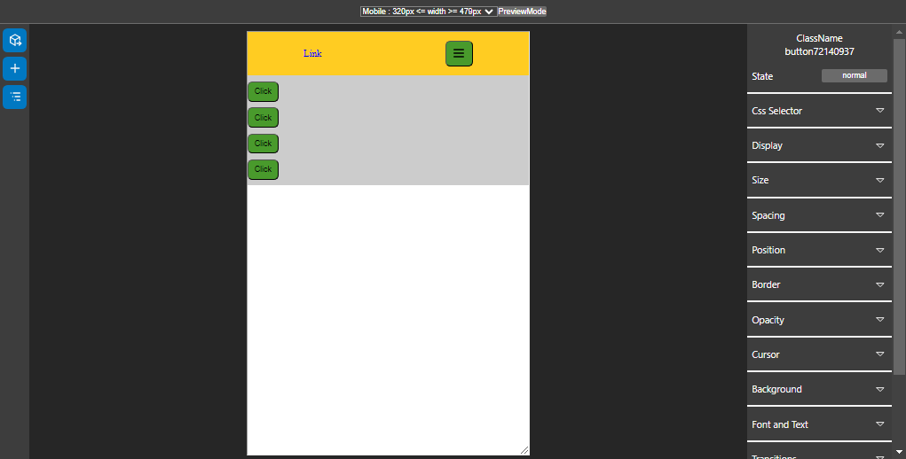

# Template Builder

Template Builder (BETA) es un project con el que podras crear plantillas arrastrando elementos en un board, podras asignar los estilos css necesarios para cambiar el aspecto de elemento, podras exportar la estructura de tu plantilla.

# Preview



Instalacion de dependencias via npm
```js
$ npm install
```
---
Instalacion de dependencias via pnpm
```js
$ pnpm i
```
---
Development
```js
$ pnpm run dev
```

